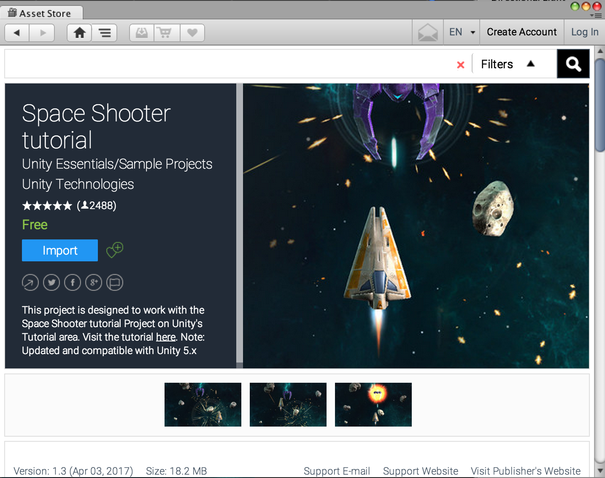
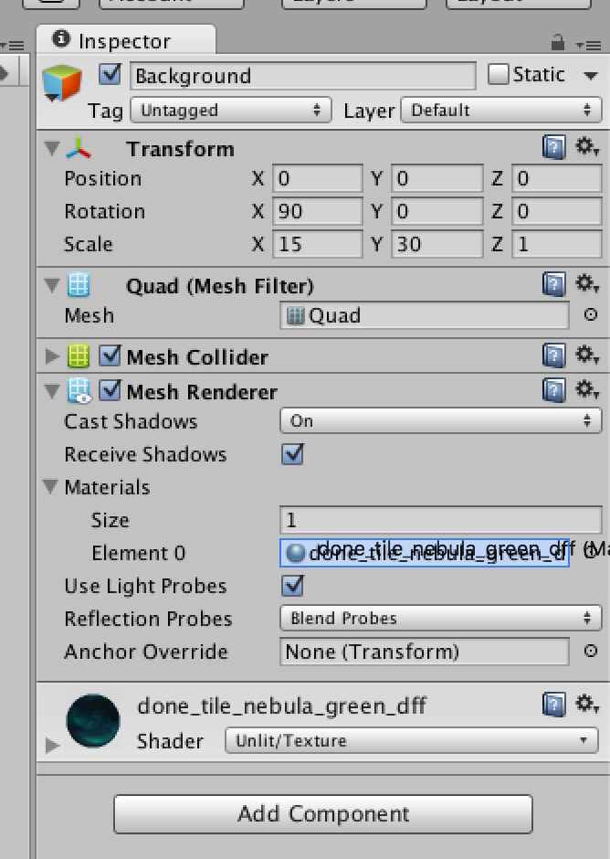
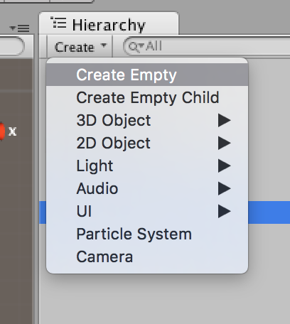
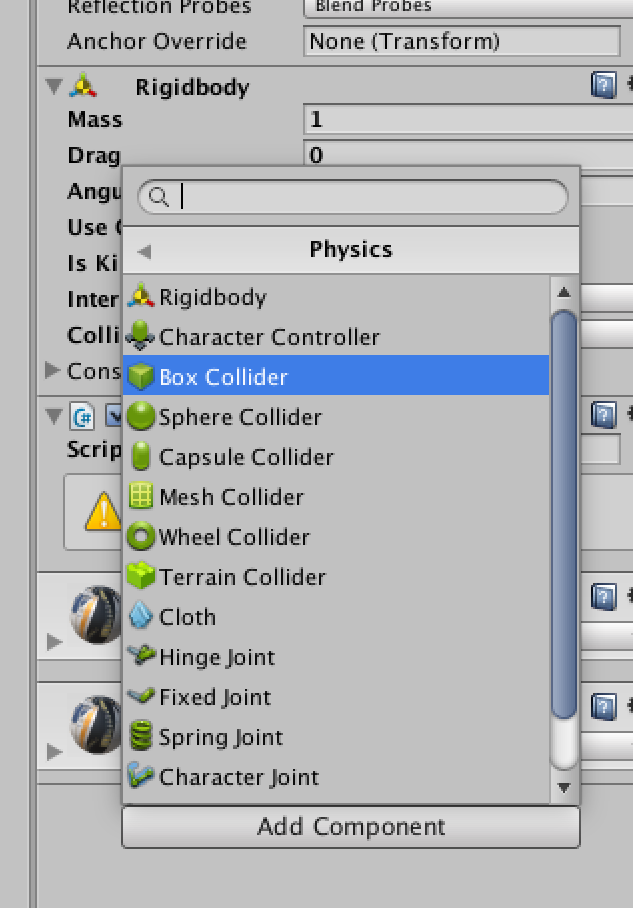
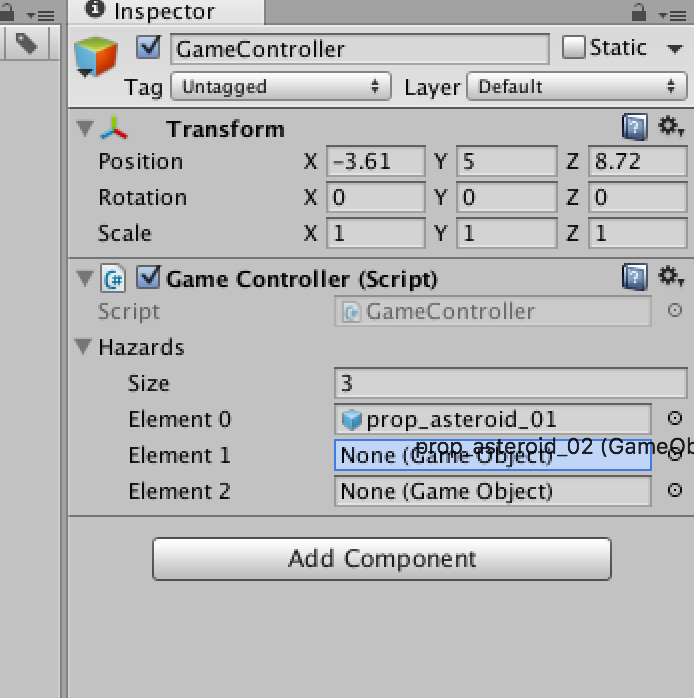

# Unity Learn

<br/>
<br/>
## Install
* https://store.unity.com/kr/download?ref=personal


## Asset 추가하기

* Window > Asset Store 에서 검색 Space Shooter > 추가




## 배경 만들기

* GameObject > 3D Object > Quad 생성

* Quad 이름 Background 로 변경

* Mesh Render 의 Material 속성에 `Textures > done_tile_nebula_green_dff` 속성 안으로 드래그해서 추가

* `scale x : 15, y : 30` 수정

* MainCamera `y : 10 rotation x : 90` 수정

* Prefabs > VFX > Starfield 파일 드래그해서 추가


 


<br/>

## 우주선 만들기

* vehicle_playerShip 드래그해서 추가
* PlayerController C# 스트립트 생성
* vehicle_playerShip 에 스트립크 연결

### PlayerController.cs

방향키로 우주선 움직이도록 스크립트 수정

```
using UnityEngine;
using System.Collections;

public class PlayerController : MonoBehaviour {

	float speed = 5;

	// Use this for initialization
	void Start () {
	
	}

	void FixedUpdate() {
		float x = Input.GetAxis("Horizontal");
		float y = Input.GetAxis("Vertical");

		Vector3 movement = new Vector3(x, 0, y);

		GetComponent<Rigidbody>().velocity = movement * speed;
		GetComponent<Rigidbody>().rotation = Quaternion.sEuler(0, 0, GetComponent<Rigidbody>().velocity.x * -5);
	}
}

```


* Rigidbody
물리 시뮬레이션을 통해서 오브젝트의 위치를 조절합니다.
리지드바디(rigidbody) 컴포넌트는 오브젝트의 위치를 제어합니다. - 중력의 영향에 의해 오브젝트를 아래로 떨어지도록 만들고,
충돌에 대한 오브젝트의 반응의 크기를 계산할 수 있습니다.

  * velocity : 리지드바디의 속력 벡터를 나타냅니다.

  * rotation : 리지드바디의 회전을 나타냅니다.


* Quaternion
쿼터니언(Quaternions)은 회전을 표현하기 위해 사용됩니다.

  * Euler : z축 주위로 z, x축 주위로 x, y축 주위로 y 각도만큼 회전한(순서대로) Rotation을 반환합니다.


### 우주선이 화면 밖으로 넘어가지 않도록 수정

Create Empty 추가 > `box Collider` Component 추가


 
 

<br/>

## 운석 만들기

Models 폴더 안의 운석들을 사용


c# 스크립트 추가
### RandomRotator.cs

```
using UnityEngine;
using System.Collections;

public class RandomRotator : MonoBehaviour {
	
	// 회전하는 값
	float tumble = 5;

	void Start () {
		GetComponent<Rigidbody>().angularVelocity = Random.insideUnitSphere * tumble;
	}
}
```
prop_asteroid_01 에 스크립트 추가

prop_asteroid_02, prop_asteroid_03 도 동일하게 만들기


* Random.insideUnitSphere : 회전 각에 대한 방향 값을 자동으로 랜덤하게 만들어줌

c# 스크립트 추가
### Mover.cs
```
using UnityEngine;
using System.Collections;

public class Mover : MonoBehaviour {

	void Start () {
		float speed = 5;
		//float speed = Random.Range(3f, 5f); // 랜덤하게 수정

		GetComponent<Rigidbody>().velocity = new Vector3(0, 0, -1) * speed;
	}
}
```
스크립트 연결하기

프로젝트에서 asteroid 폴더 생성 폴더안에 `prop_asteroid_01, prop_asteroid_02,prop_asteroid_03` 넣고 Hierarchy 의 `prop_asteroid_01, prop_asteroid_02, prop_asteroid_03`은 삭제

<br/>
## GameController

C# 스크립트 GmaeController 생성 

GameObject > Creat Empty 생성 후 GameController연결


public 변수 생성

```
...

public GameObject[] hazards;

...
```

unity 에서 public으로 생성된 변수에 값 연결하기

 


GameController.cs

```
using UnityEngine;
using System.Collections;

public class GameController : MonoBehaviour {

	public GameObject[] hazards;
	float startWait = 1;
	float enemyWait = 1;
	float waveWait = 1;

	void Start () {
		StartCoroutine(EnemyWaves());
	}

	IEnumerator EnemyWaves() {

		yield return new WaitForSeconds(startWait);

		while(true) {
			for(int i = 0; i < 10; ++i) {
				GameObject hazard = hazards[Random.Range(0, hazards.Length)];
				Vector3 enemyPosition = new Vector3(Random.Range(-6, 6), 0, 15);
				Quaternion enemyRotation = Quaternion.Euler(new Vector3(0, 180, 0));

				Instantiate(hazard, enemyPosition, enemyRotation);
				yield return new WaitForSeconds(enemyWait);
			}
			yield return new WaitForSeconds(waveWait);
		}

	}
}
```

* Coroutine(코루틴) 함수 활용 : IEnumerator
	* MonoBehaviour.StartCoroutine은 코루틴(Coroutine)을 반환한다. 이 클래스의 인스턴스는 오직 이 코루틴들에 대한 참조로 사용되며 어떠한 노출된 프로퍼티나 함수도 담지 않습니다.
	* 코루틴은 주어진 YieldInstruction이 끝날 때까지 해당 수행을 멈출 수 있는 함수입니다.


<br/>
## 우주선 총 만들기

* GameObject > 3D Object > Quad 생성
	* `rotation x : 90` 설정

* Mesh Render 의 Material 속성에 `Textures > done_fx_bolt_orange_mat`` 속성 안으로 드래그해서 추가

	* Project에 폴더로 따로 저장 후 삭제

* GameObject > Creat Empty 생성 후 vehicle_playerShip 안으로 파일 드래그 (이름 변경 firePosition)

	* position을 우주선으로 맞춰 수정


PlayerController.cs 수정

```
...
public GameObject shot;
public Transform firePosition;

void Update() {
	// alt키를 눌렀을때
	if (Input.GetButtonDown("Fire2") == true) {
		Instantiate(shot, firePosition.position, firePosition.rotation);
	}
}
...
```

unity에서 shot , firePosition 연결하기


<br/>
## 충돌 구현하기

C# 스크립트 DestoryByContact 생성

prop_asteroid_01, prop_asteroid_02, prop_asteroid_03 에 스크립트 연결

```
using UnityEngine;
using System.Collections;

public class DestoryByContact : MonoBehaviour {

	public GameObject explosion;

	void Start () {
	}
	// 충돌이 일어날때 누구와 충돌이 되었는지 알려줌
	void OnTriggerEnter(Collider other) {

		Instantiate(explosion, transform.position, transform.rotation);
	}
}
```

* OnTriggerEnter

	* Collider가 다른 트리거 이벤트에 침입했을 때 OnTriggerEnter가 호출됩니다.

	* 이 메시지는 트리거 상태의 콜라이더와 (만약 있는 경우) 트리거 상태의 콜라이더와 함께 연결되어 있는 Rigidbody, 트리거에 닿아 있는 Rigidbody(Rigidbody가 없는 경우는 콜라이더)로 전송됩니다. 유의: 충돌 이벤트는 오직 콜라이더 중 하나가 non-kinematic 강체를 가지고 있을 때 보냅니다. 비활성 MonoBehaviour에도 충돌반응에 의한 Behaviour활성화가 가능하게 하기 위해서 충돌 이벤트를 보냅니다.


`prop_asteroid_01`... 03 에 Component > boxCollider 추가

isTrigger 체크하기


#### DestoryByContact.cs 수정

```
void OnTriggerEnter(Collider other) {

	Instantiate(explosion, transform.position, transform.rotation);

	// 자기자신 없애기
	Destroy(gameObject);
	// 충돌될 대상
	Destroy(other.gameObject);
}
```

충돌되는지 확인

### 잘되면 예외처리


`prop_asteroid_01, prop_asteroid_02, prop_asteroid_03` 에 `Enemy` 태그 추가
`vehicle_playerShip` 에 `Player` 태그 추가 

#### DestoryByContact.cs 수정

```
public GameObject playerExplosion;
void OnTriggerEnter(Collider other) {

	Instantiate(explosion, transform.position, transform.rotation);

	// 지들끼리 부딪혀 없어지지 않게 예외처리
	if(other.gameObject.tag == "Enemy") {
		return;
	}

	if (explosion != null) {
		// 효과 보여주기
		Instantiate(explosion, transform.position, transform.rotation);
	}

	// 으앙 쥬금
	if(other.tag == "player") {
		// 효과 보여주기
		Instantiate(playerExplosion, other.transform.position, other.transform.rotation);
	}
	...
}

```

unity 에서 `playerExplosion` 연결하기


<br/>
## 빌드

